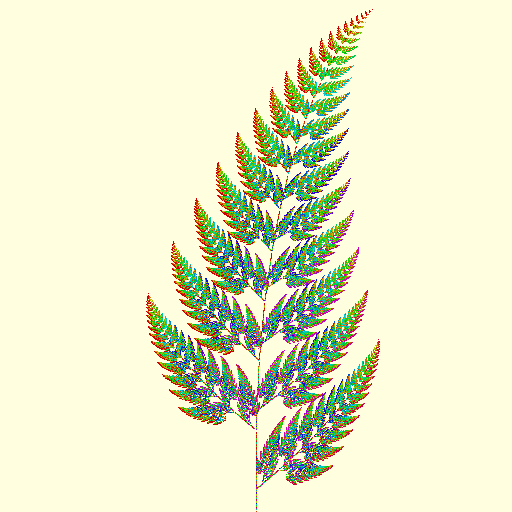
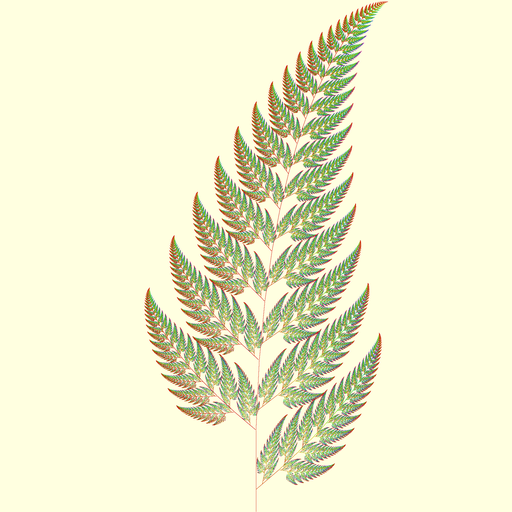
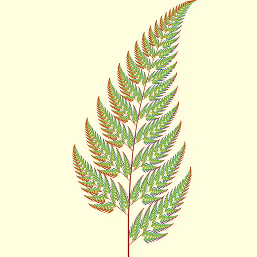



## Year 2009 Version

In year 2009, Facebook used to be quite a different place than what it is today. Back then,  only a handful of us from the then younger generation used to have Facebook accounts. We would take "What's on your mind, Jatin?" prompt literally and share all our thoughts without worrying about accuracy or fear of being judged by others.

Over the years, the use of Facebook as a medium to socialize has declined. I think any social network that is based on people connections is liable to become outdated as its users age. When young generations see their uncles and aunts on the network, they do not feel comfortable being their true selves—the cool personality they showcase in front of their friends and peers, and so they seek out a platform with more youthful demographics. An exception to this trend is LinkedIn, where user profiles and activities rarely match with their true identities.

Coming back to the main topic, I remember my friend posted a few images of [fractal trees](https://en.wikipedia.org/wiki/Fractal_canopy) generated with Python in October 2009. In its response, I decided to create [Barnsley fern](https://en.wikipedia.org/wiki/Barnsley_fern) using Python and shared my image along with the code. I cannot recall all the details now, but I suspect that I must have referred to the [pseudocode](https://en.wikipedia.org/wiki/Barnsley_fern#Pseudocode) on Wikipedia page as my code matches it to some extent. However, I would still like to take credit for the color scheme as it took many trials and errors to arrive at it. You can check out my code [here]()

## *Year 2009 Version (Revised)*

*As I was writing this blog post, I realized that I could make a few minor adjustments to the original program to address some obvious issue and output a better quality image. The new program also takes less time to execute. Please find the revised code [here](). However, also note that the later sections in the article are still referring to the original version from 2009.*

## Year 2024 Version

Fast forward to October 2024, and Facebook reminded me of my post as a 15-year-old “memory” and I re-shared it with my friends. There I had a thought that while I was very proud of my creation in 2009, it did not live up to the 2024-standards where we are spoilt by HD images surrounding us everywhere. The main stem of the fern was pencil-thin, and dots used to create the image were unevenly distributed, leaving some areas empty, causing it to fail to resemble a real fern.

Hence, to improve over the previous version, I set out to code a new program from scratch with the following changes in mind.

### Using Polygons

Instead of beginning with a single point, I went for a polygon to directly draw the first segment of the main stem. This allowed me to assign the desired thickness to the stem and reduce the number of required fractal transformations from four to three. This, in effect, improved the time-complexity of the algorithm from \\(4^n\\) to \\(3^n\\), where \\(n\\) is the desired number of iterative transformations that we wish to apply. The deeper we iterate, the finer is the quality of the final image.

### Deterministic Algorithm

To keep the computation in check, the earlier program used random numbers to iteratively pick one among the four transformations and apply them instead of trying every combination, which would be as high as \\(4^{20}\\). I thought that we could avoid the random component and hence, I replaced it with a deterministic algorithm.

### Unbounded Iterations

With every transformation, we end up reducing the size of the polygon. Hence, I decided to apply these iterative tranformations indefinitely until the polygon's size fell below a certain threshold, at which point I would exit that iteration. To find the size of the transformed polygon, I just multiplied the area of previous polygon by the scaling factor of the transformation. I recalled the learning from 3Blue1Brown Youtube video on [determinants](https://www.3blue1brown.com/lessons/determinant), which explained how the determinants and scale factors are related. I calculated the determinants of the three transformation matrices and hardcoded these values into the program. This approach allowed me to draw the entire fern without missing any portions and prevented unnecessary iterations that could have resulted in miniscule polygons.

Despite the above changes, I wanted to retain the essence of the original design, and hence tried to keep the image dimension, position and color scheme consistent. The color scheme could not be matched exactly though since the iteration paths in the two programs were different. Here’s how the fern looks like now. You can find the updated code [here]().

## What's Next

This concludes my exploration of the Bransley Fern images. I had initially planned to include my work on the Barnsley Fern fractal animations in here, and share a few animation videos with interesting zoom effects. However, to keep things short, I am saving that discussion for a separate article. Thanks for reading all the way to the end!
